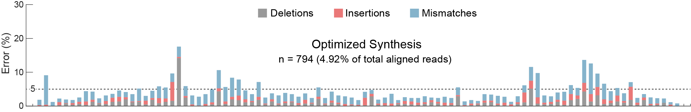
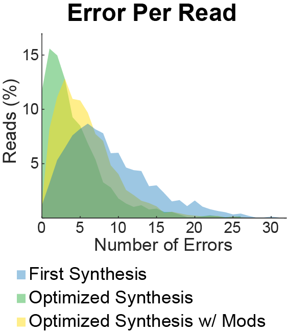
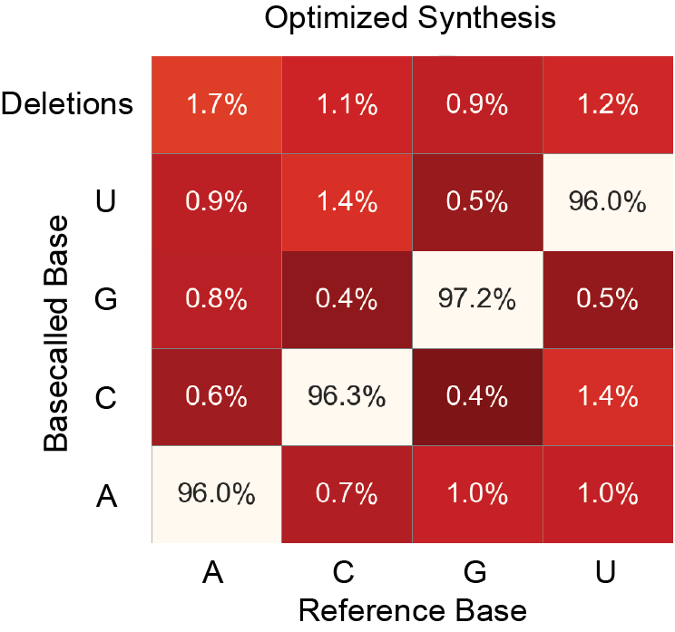
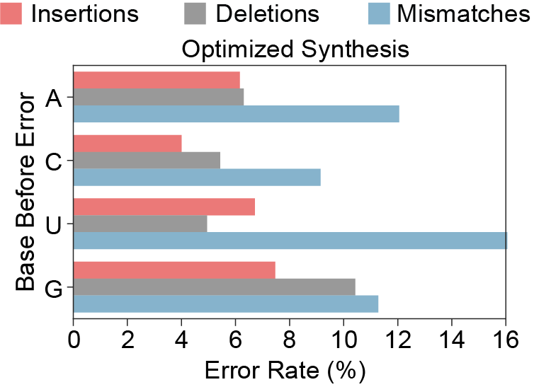

# PRECISE-QC Plotting Notebooks

Jupyter notebooks in this folder reproduce four error-analysis plots from the PRECISE-QC (Yee et al., 2025).  
If you provide an **aligned BAM** of full-length reads and an **error profile table** (from `pysamstats --type variation`), you can regenerate the figures exactly.

The notebooks are tailored for use on Google Colab for convenience, but they can also be run in a standard Jupyter Notebook environment

> **Inputs expected**
> - `data/full_length.bam` (plus indexed bam should eb in the same folder `data/full_length.bam.bai`)
> - `data/error_profile.txt` (please refer to the Repo README.md to generate it)
---

## Plots generated

1. **Full-length RNA error analysis** 

   *Error_nucleotide.ipynb*

   Base-by-base error profile of in-silico purified sgRNA **before vs after** optimization (“quality consultation”).
   
   Full-length RNA error analysis 


____________________

2. **Errors per full-length read**  

   *Error_read.ipynb*

   Histogram of total errors (mismatch+insertion+deletion) per read.

   Errors per full-length read


____________________

3. **Confusion matrices** 

   *Confusion__Matrix_Base_specific.ipynb*

   Heatmaps of **deletions** and **mismatches** by reference vs observed base
   
   Confusion matrices (deletions & mismatches)**  



____________________

4. **Error types by base**  

   *Confusion__Matrix_Base_specific.ipynb*

   Bar plots of error rates (mismatch/insert/delete) stratified by reference base **A, U, C, G**.

   Error types by base 


---


## Requirements

- Python ≥ 3.10
- JupyterLab / Notebook
- Packages: `pysam`, `numpy`, `pandas`, `matplotlib`, `seaborn`

> If starting fresh:
> ```bash
> pip install numpy pandas matplotlib seaborn pysam
> ```

---
### Data type 

- `full_length.bam` should contain reads filtered to your length window (e.g., **95–105 nt**) **after** removing soft-clipping from CIGAR and trimming SEQ/QUAL accordingly.
- `error_profile.txt` should be generated with the same reference used for alignment, e.g.:
  ```bash
  pysamstats --type variation --fasta REF/reference.fa data/full_length.bam > data/error_profile.txt
